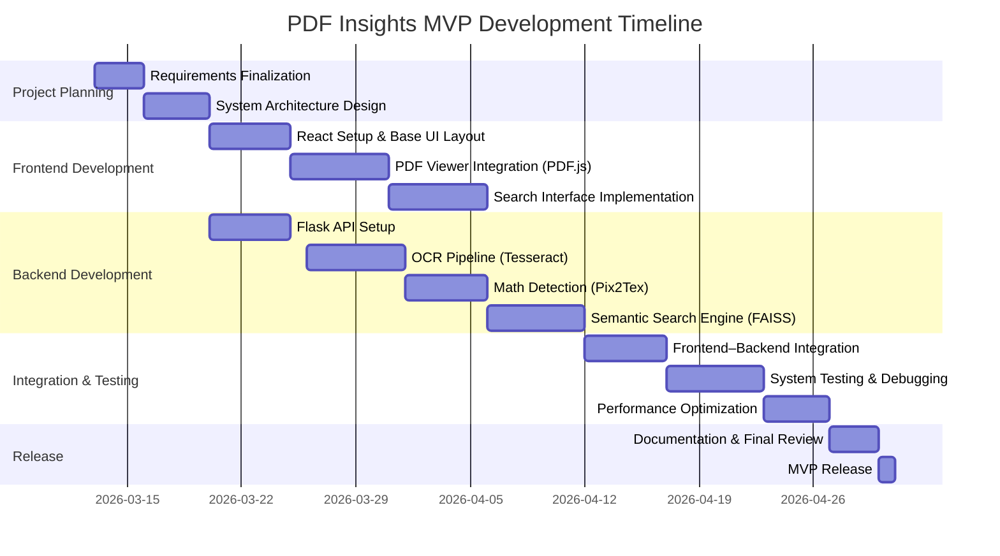

<div align="center">
  

  <h1 style="font-size: 3em; margin: 20px 0;">PDF INSIGHTS</h1>
  <h2 style="color: #4A90E2; margin: 10px 0;">Smart PDF Analyzer with OCR and Semantic Search</h2>

  <br>


<br>


</div>


# Table of Contents

- [Table of Contents](#table-of-contents)
- [The Project](#the-project)
- [Tools and Technologies](#tools-and-technologies)
    - [Core Components](#core-components)
- [Why This Project Different](#why-this-project-different)
    - [Limitations of Current Tools](#limitations-of-current-tools)
    - [How PDF Insights Solves These Problems](#how-pdf-insights-solves-these-problems)
- [What This Project Intent For](#what-this-project-intent-for)
    - [Target Users](#target-users)
- [How it Works](#how-it-works)
- [Activity Diagram](#activity-diagram)
- [Sequence Diagram](#sequence-diagram)
- [Project Window](#project-window)
- [Screenshots](#screenshots)
- [Developer Info](#developer-info)


# The Project

Working with **research papers, scanned books, and technical PDFs** is often frustrating.  
Traditional tools like **Adobe Acrobat** or **Foxit PDF Reader** mainly rely on **keyword search**, which means the user must know the *exact words* in the document.

However, in academic or technical environments, users often search for **ideas, explanations, or concepts** rather than exact keywords.

This is where **PDF Insights** comes in.

**PDF Insights** is a **smart PDF analysis platform** designed to understand documents beyond simple text matching.

The system is capable of:

- Performing **semantic search** that understands meaning rather than just keywords
- Extracting text from scanned PDFs using **OCR**
- Detecting **mathematical equations** inside documents
- Converting equations into **LaTeX format**
- Highlighting relevant sections directly in the PDF viewer
- Exporting extracted knowledge as **Markdown documents with LaTeX support**
- Providing **transparent processing metrics** so users can understand how the system analyzed their PDF

Unlike conventional tools, PDF Insights is designed specifically for **academic and technical document analysis**, where **context, equations, and semantic understanding** are crucial.

The system runs entirely on **standard CPU hardware**, making it accessible for students, researchers, and institutions without requiring expensive infrastructure.


# Tools and Technologies

| React.js | TailwindCSS | Flask |
|----------|-------------|-------|
|  |  |  |

### Core Components

| Layer | Components |
|------|------------|
| **Frontend** | • React.js<br>• Tailwind CSS<br>• PDF.js |
| **Backend** | • Flask API<br>• Python 3.10 |
| **AI / Processing** | • SentenceTransformers (all-MiniLM-L6-v2)<br>• FAISS Vector Search<br>• Tesseract OCR<br>• PyMuPDF<br>• Pix2Tex |


# Why This Project Different

Most modern PDF tools provide features like:

- Basic OCR
- Keyword search
- Simple highlighting

However, these systems have several limitations.

### Limitations of Current Tools

1️⃣ **Keyword-based search only**  
Users must type the exact words used in the document.

2️⃣ **No semantic understanding**  
If a document says *“neural networks”* and the user searches *“deep learning models”*, traditional tools fail.

3️⃣ **Poor support for mathematical documents**  
Many academic PDFs contain equations that cannot be extracted properly.

4️⃣ **Lack of transparency**  
Users rarely know:
- Which pages were OCR processed
- How accurate the extraction is
- Which parts were actually analyzed


### How PDF Insights Solves These Problems

PDF Insights introduces several improvements:

✔ **Semantic Search**  
The system understands meaning using **SentenceTransformers embeddings**.

✔ **Vector Search Engine**  
Using **FAISS**, the system can retrieve conceptually related content quickly.

✔ **Equation Detection**  
Mathematical expressions are detected and converted to **LaTeX** using Pix2Tex.

✔ **Processing Transparency**  
The system shows:
- OCR confidence
- scanned vs text pages
- analysis metrics

✔ **Research-friendly Export**  
Content can be exported as **Markdown with LaTeX**, making it easy to reuse in academic writing.


# What This Project Intent For

PDF Insights is designed primarily for **academic and research environments**.

### Target Users

**University Students**
- Reading textbooks
- Searching concepts across lecture materials
- Extracting notes from PDFs

**Researchers**
- Reviewing literature
- Finding relevant ideas inside long research papers
- Extracting mathematical formulas

**Professors**
- Preparing lecture content
- Reviewing technical documents

**Data Scientists**
- Exploring technical reports
- Understanding mathematical research documents

**Academic Institutions**
- Shared knowledge extraction
- Technical documentation analysis

The goal is to provide a **tool that helps users quickly understand large academic documents** without manually scanning hundreds of pages.


# How it Works

PDF Insights follows a **multi-stage document processing pipeline**.

1️⃣ The user uploads a PDF file.  
2️⃣ The system detects whether pages contain **text or scanned images**.  
3️⃣ If scanned pages exist, **OCR (Tesseract)** extracts the text.  
4️⃣ If math detection is enabled, **Pix2Tex** identifies equations and converts them to **LaTeX**.  
5️⃣ Extracted content is processed using **SentenceTransformers** to generate semantic embeddings.  
6️⃣ The embeddings are indexed using **FAISS** for fast similarity search.  
7️⃣ The user can then perform:

- Normal keyword search
- Semantic meaning-based search

The system highlights relevant content and OCR result can export as **Markdown** includes LaTeX format.

> [!IMPORTANT]
> For a detailed API and system architecture, Click the **full documentation**.


# Activity Diagram

```mermaid
flowchart TD
    A([Start]) --> B{Upload PDF}
    B --> C[Detect Page Type]
    C --> D{Scanned Pages}
    D -->|Yes| E[Run OCR]
    D -->|No| F[Extract Text]
    E --> G[Compute OCR Confidence]
    F --> G
    G --> H{Math Detection Enabled}
    H -->|Yes| I[Detect Equations]
    H -->|No| J[Skip]
    I --> K[Convert to LaTeX]
    J --> K
    K --> L[Build Semantic Index]
    L --> M[Enable Search]
    M --> N([Export Markdown])
````


# Sequence Diagram

```mermaid
sequenceDiagram
    participant User
    participant Frontend
    participant Backend
    participant OCR
    participant Math
    participant VectorSearch

    User->>Frontend: Upload PDF
    Frontend->>Backend: POST /upload
    Backend->>OCR: Run OCR if needed
    Backend->>Math: Detect equations
    Backend->>VectorSearch: Build FAISS index
    Backend-->>Frontend: Return analysis results

    User->>Frontend: Semantic Query
    Frontend->>Backend: POST /semantic_search
    Backend->>VectorSearch: Retrieve results
    VectorSearch-->>Backend: Top matches
    Backend-->>Frontend: Results + page numbers
```


# Project Window

The following timeline represents the **Minimum Viable Product (MVP)** development schedule for PDF Insights.




# Screenshots

Screenshots of the application interface will be added after the **UI development phase is completed**.

Planned screenshots include:

* Landing page
* PDF upload interface
* Analyzer dashboard
* Semantic search results
* PDF highlight view
* Markdown export output


# Developer Info

**Irshad Hossain**<br/>
Software Engineering Student <br/>
University of Frontier Technology, Bangladesh

**Course** <br/>
PROG 112 — Object Oriented Programming Sessional

Email
[irshadrisad11@gmail.com](mailto:irshadrisad11@gmail.com)

GitHub
[https://github.com/Irshad-11](https://github.com/Irshad-11)


